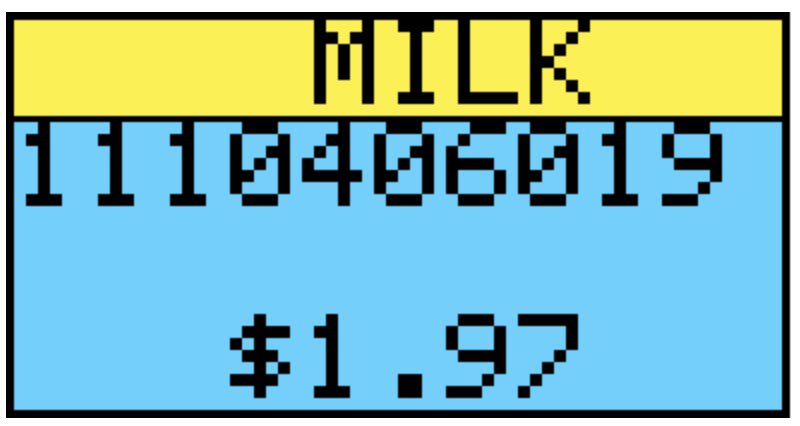
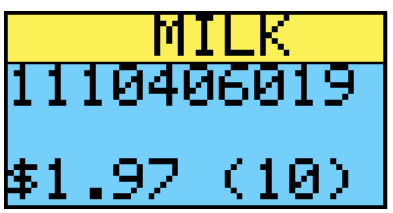

# shelflabel

Shelf Label is a small IOT device that attaches to a store shelf for displaying name, unit, and pricing with bluetooth connectivity. The shelf label as known as an ELECTRONIC SHELF LABEL has government regulation as specificed at [https://www.cga.ct.gov/2000/rpt/2000-R-1044.htm](https://www.cga.ct.gov/2000/rpt/2000-R-1044.htm)

The shelf label will ONLY need to show the Product name, price and UPC number for human reference, as in the following example,

The ESP32/8266 use bluetooth to interact with a mobile device to provide additional information as well as price and product changes. The label can even show the quantity available on the shelf,

